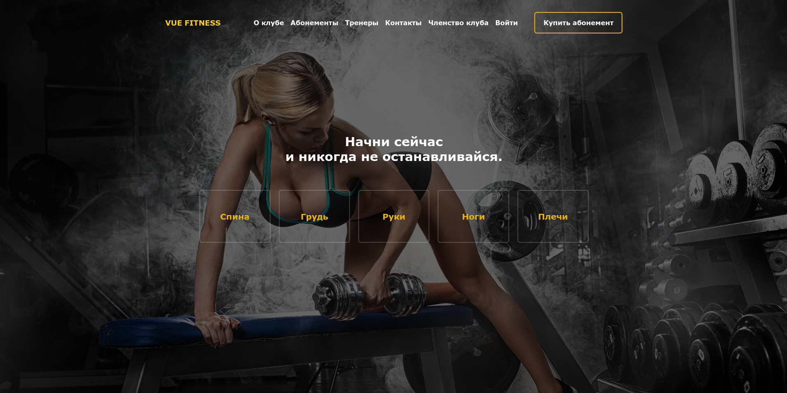

# Сайт "Фитнес-клуба" на Django и Vue.js



### Инструменты

#### Backend

- Python
- Django
- CK-Editor
- PostgreSQL
- Celery
- Redis
- Docker

#### Frontend

- Vue.js
- Typescript
- Pinia
- Tailwind
- Swiper
- Gsap
- Axios

---

### Функционал

- Регистрация
- JWT авторизация
- Просмотр постов
- Детальная информация о тренере
- Оставление отзыва и рейтинга
- Запись на персональную тренировку
- Покупка абонемента
- Подписка на новости

---

### Команды для запуска сайта

> Backend

```bash
python manage.py runserver
```

> Frontend

```bash
npm run dev
```
